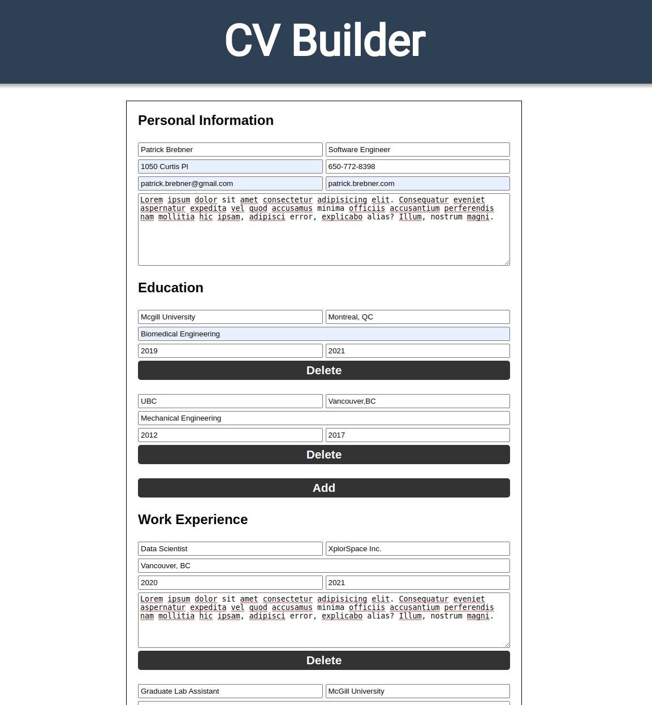
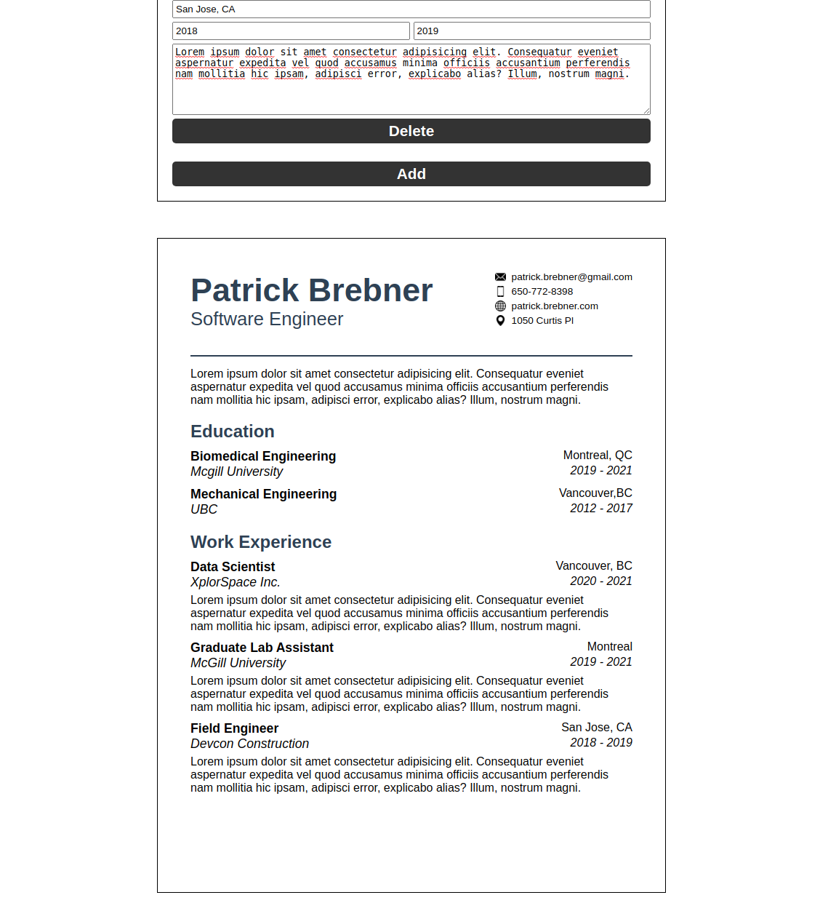

# CV Application Project

## About

A React website app that builds a CV for a work application. Fill in the fields to generate a resume. Images below show results of using the app.

This was my first project using React to build an app. I utilized class components and my knowledge of states and props to build the app.

[Try it out](https://pbrebner.github.io/cv-project/)

## Topics Covered

-   React
-   States and Props
-   Class Components
